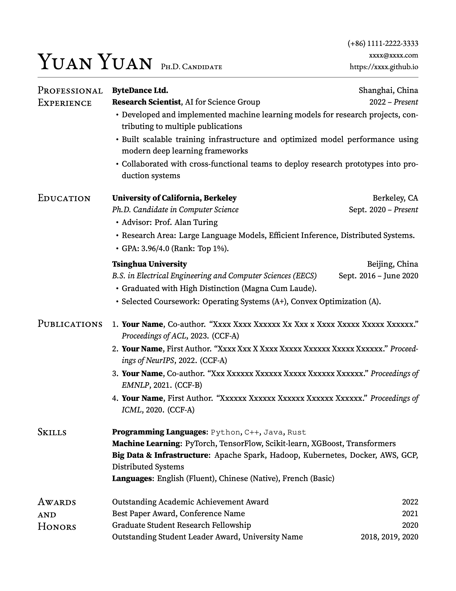

<h1 align="center">Yuan² Resume (Yuan-Squared)</h1>

<p align="center">
  <em>A clean two-column LaTeX resume template with precise alignment and modern typography.</em>
</p>

<p align="center">
  <a href="https://github.com/eugenejyuan/yuan2-resume">
    
  </a>
  <a href="https://www.latex-project.org/">
    
  </a>
  <a href="https://github.com/eugenejyuan/yuan2-resume/blob/main/LICENSE">
    
  </a>
</p>

> Originally created by [Yuanhf](https://github.com/xyz-yuanhf/yuan-resume), modernized and refactored by Jing Yuan.
> The name “Yuan²” (Yuan-Squared) reflects a refined evolution of the original Yuan resume template.

An elegant LaTeX resume template featuring **a clean two-column layout**, precise alignment, and flexible font configuration.

Yuan² Resume is a modern refactor of the classic `yuan-resume` project, redesigned with improved typography, modular structure, and better customization support.
It works well for academic, research, and technical resumes across both academia and industry.

| Default Fonts (Open source) | Commercial Fonts |
|----------|----------|
|  |  |

<p align="center">
  <em>Two font configurations included: fully open-source by default, with optional commercial typography.</em>
</p>

<details>
<summary><strong>📑 Table of Contents</strong></summary>

<br>

- [Quick Start](#quick-start)
- [Font Configuration](#font-configuration)
- [Usage](#usage)
- [Compilation](#compilation)
- [Project Structure](#project-structure)
- [License](#license)
- [Credits](#credits)
- [Contributing](#contributing)

</details>

<p align="center">· · ·</p>

## Quick Start

1. **Clone or download** this repository
2. **Edit** `main.tex` with your information
3. **Compile** with XeLaTeX: `xelatex main.tex`

### Online Editing

You can also use **[use this template on Overleaf with one click](https://www.overleaf.com/docs?snip_uri=https://github.com/eugenejyuan/yuan2-resume/archive/main.zip)** for online editing and compilation.

Or manually:
- Upload the project files
- Set the compiler to **XeLaTeX** in the project settings
- Compile and download your PDF

## Font Configuration

This template supports two font sets: **default** (open-source) and **commercial** (requires manual font installation).

### Switching Font Sets

To switch between font sets, modify the `fontset` option in `main.tex`:

```latex
% For open-source fonts (default)
\documentclass[fontset=default]{yuan2resume}

% For commercial fonts (requires font files)
\documentclass[fontset=commercial]{yuan2resume}
```

### Default Font Set (Open-source)

The default font set uses open-source fonts that are included in this repository:

- **Main Font**: Source Serif 4 (by Adobe)
- **Title & Section Font**: EB Garamond
- **Code Font**: TeX Gyre Cursor

All default fonts are freely available and can be used without additional licensing fees.

### Commercial Font Set

The commercial font set uses premium fonts that require separate purchase or licensing:

- **Main Font**: Sabon LT Std
- **Title Font**: Calluna
- **Section Font**: Cronos Pro LT
- **Code Font**: Courier New (typically pre-installed on Windows/macOS systems)

#### Installing Commercial Fonts

Once you have obtained the commercial font files, place them in the following directory structure:

```
fonts/
├── SabonLTStd/
│   ├── SabonLTStd-Regular.ttf (or .otf)
│   ├── SabonLTStd-Bold.ttf
│   ├── SabonLTStd-Italic.ttf
│   └── SabonLTStd-BoldItalic.ttf
├── Calluna/
│   └── Calluna-Regular.otf (or .ttf)
├── CronosProLT/
│   └── CronosProLT-Regular.ttf (or .otf)
└── CourierNew/
    └── CourierNew-Regular.ttf (or .otf)
```

The template will automatically detect font files with `.otf`, `.ttf`, `.OTF`, or `.TTF` extensions. After placing the fonts in the correct directories, change the `fontset` option to `commercial` in `main.tex` and recompile.

## Usage

### Basic Commands

Edit `main.tex` to customize your resume:

```latex
\name{Your Name}
\position{Your Position}
\phone{+1 (234) 567-8900}
\email{your.email@example.com}
\homepage{https://yourwebsite.com}
```

### Content Sections

The template provides several environments and commands:

- `\begin{cvtwocolumn}` - Two-column layout container
- `\begin{cvsection}{Section Name}` - Section with left-aligned heading
- `\cvpair{Left}{Right}` - Left-right aligned pair
- `\begin{cvitemize}` - Bullet list
- `\begin{cvnumlist}` - Numbered list

See `main.tex` for complete examples.

## Compilation

### Requirements

- **XeLaTeX** (required)
- LaTeX distribution (TeX Live, MiKTeX, or MacTeX)
- Required packages (usually included):
  - `fontspec`
  - `paracol`
  - `tabularx`
  - `enumitem`
  - `xparse`
  - `xstring`
  - `hyperref`

### Compilation Command

```bash
xelatex main.tex
```

For multiple passes (to resolve references):

```bash
xelatex main.tex
xelatex main.tex
```

### Troubleshooting

- **Font not found errors**: Ensure font files are in the correct `fonts/` subdirectories
- **Compilation errors**: Make sure you're using XeLaTeX, not pdfLaTeX
- **Missing packages**: Install required LaTeX packages through your distribution's package manager

## Project Structure

```
yuan2-resume/
│
├── main.tex                    # Main entry file (edit this)
├── yuan2resume.cls             # Core document class
│
├── configs/
│   ├── fonts-default.tex       # Open-source font configuration
│   └── fonts-commercial.tex    # Commercial font configuration
│
├── fonts/                      # Font files directory
│   ├── SourceSerif4/           # Included (open-source)
│   │   ├── SourceSerif4-Regular.otf
│   │   ├── SourceSerif4-Bold.otf
│   │   ├── SourceSerif4-It.otf
│   │   ├── SourceSerif4-BoldIt.otf
│   │   └── LICENSE.md
│   ├── EBGaramond/             # Included (open-source)
│   │   ├── EBGaramond-Regular.ttf
│   │   └── OFL.txt
│   ├── tex-gyre-cursor/        # Included (open-source)
│   │   ├── tex-gyre-cursor-regular.otf
│   │   └── COPYRIGHT.txt
│   ├── SabonLTStd/             # User-provided (commercial, not in repo)
│   ├── Calluna/                # User-provided (commercial, not in repo)
│   ├── CronosProLT/            # User-provided (commercial, not in repo)
│   └── CourierNew/             # User-provided (commercial, not in repo)
│
├── assets/
│   ├── font-default.png        # Preview of default font set
│   └── font-commercial.png     # Preview of commercial font set
│
├── LICENSE
└── README.md                   # This file
```

**Note:** Commercial font files are not included in this repository due to licensing restrictions. You need to obtain and place them manually in the `fonts/` directory as described in the [Commercial Font Set](#commercial-font-set) section.


## License

This template is released under the **MIT License**. See [LICENSE](LICENSE) file for details. The original [yuan-resume](https://github.com/xyz-yuanhf/yuan-resume) project also uses the MIT License.

**Font License Note:** The included open-source fonts (Source Serif 4, EB Garamond, TeX Gyre Cursor) are subject to their respective licenses (SIL OFL and GUST Font License). Commercial fonts (Sabon, Calluna, Cronos Pro, Courier New) are not included and must be obtained separately with appropriate licensing.

## Credits

- **Original template**: [yuan-resume](https://github.com/xyz-yuanhf/yuan-resume) by [Yuanhf](https://github.com/xyz-yuanhf)
- **Inspired by**: [Jian Xu's CV](http://www.jianxu.net/en/files/JianXu_CV.pdf) and [Matty's Resume](https://github.com/mattyHerzig/mattys_resume)
- **Refactored and enhanced**: 2025

This project is a modern refactor of the original yuan-resume template, featuring improved font management, better code organization, and enhanced customization options.

## Contributing

Contributions, issues, and feature requests are welcome! 

When contributing:
- Follow the existing code style
- Test your changes with both font sets if possible
- Update documentation as needed
- Ensure all included fonts remain properly licensed

## Acknowledgments

Thanks to all the font designers and the open-source community for making beautiful typography accessible. Special thanks to **Gemini**, **GPT**, and **Cursor App** for their invaluable assistance in the development of this template.
