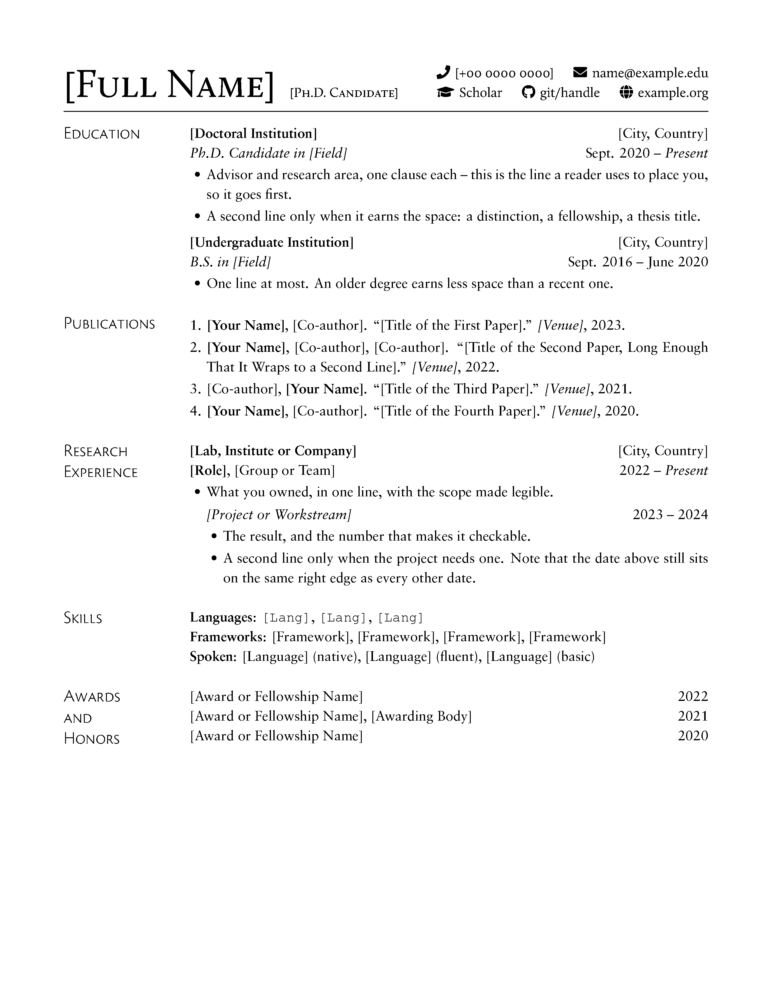
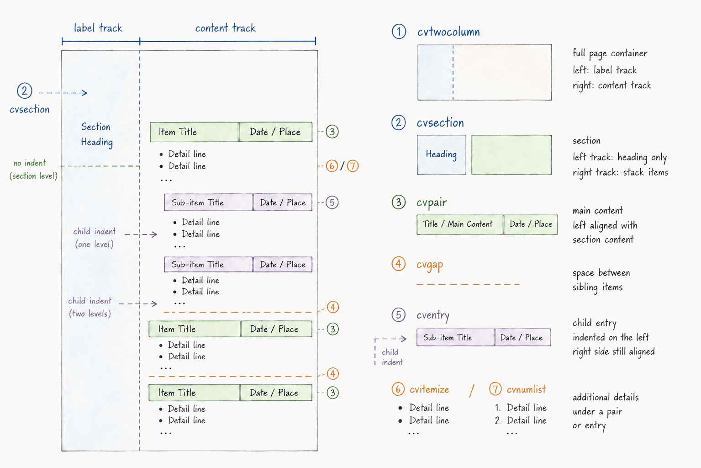

<h1 align="center">Yuan² Resume</h1>

<p align="center">
  <em>A typographic grammar for résumés — not a fill-in-the-blank template.</em>
</p>

<p align="center">
  <a href="https://github.com/eugenejyuan/yuan2-resume"></a>
  <a href="https://www.latex-project.org/"></a>
  <a href="https://github.com/eugenejyuan/yuan2-resume/blob/main/LICENSE"></a>
</p>

> Originally created by [Yuanhf](https://github.com/xyz-yuanhf/yuan-resume).
> “Yuan²” is a refined evolution of the original Yuan resume template.

<table>
  <tr>
    <td width="35%" valign="top">
      <br>
      <sub><b>The output.</b> <a href="examples/academic.tex"><code>academic.tex</code></a> under the commercial font set, regenerated by <code>make preview</code> — every field in it is a placeholder slot.</sub>
    </td>
    <td width="65%" valign="top">
      <br>
      <sub><b>The grammar.</b> The seven primitives, and where each one lands on the page: <code>cvsection</code> owns the label rail, <code>cvpair</code> is the only thing that reaches the right margin, <code>cvgap</code> the only way to add space.</sub>
    </td>
  </tr>
</table>

## The idea

Most resume templates are forms: they define a fixed set of sections and you fill in the
blanks. This one defines **seven composable primitives and six invariants**. Any
arrangement that preserves the invariants comes out correctly aligned — including
arrangements nobody has tried yet.

```latex
\begin{cvtwocolumn}[<ratio>]   % container; label rail defaults to 0.18
\begin{cvsection}{<heading>}   % one row of the grammar: label left, content right
\cvpair{<left>}{<right>}       % full-width line, right cell flush right
\cvgap[<n>]                    % one unit of separation between sibling entries
\begin{cventry}[<indent>]      % nested sub-unit; indents from the left only
\begin{cvitemize}              % bullet list
\begin{cvnumlist}              % numbered list, digit-aligned
```

That is the entire vocabulary. Every date and location lands on **one** shared right
edge, at any nesting depth, because `\cvpair` is the only thing allowed to align left
against right. Every vertical gap is a multiple of `\baselineskip`, because `\cvgap` is
the only way content can add space at all.

So the question is never “which section type do I use?” but “which primitives compose
into the shape this person’s history actually has?”
[`examples/academic.tex`](examples/academic.tex) and
[`examples/industry.tex`](examples/industry.tex) are two answers — one with Publications
and Awards, one with Open Source and Speaking. Neither is *the* shape of a resume. Both
are placeholder skeletons: every name, employer, venue and number is a bracketed slot, so
they show the shape without inventing a person.

**Read [`docs/GRAMMAR.md`](docs/GRAMMAR.md) before writing content.** It is short, and it
is the whole design.

## Quick start

You need XeLaTeX from TeX Live, MiKTeX or MacTeX, plus `curl` for the one-time font
download. Font binaries are not committed, so install the pinned files from the
original template before the first build:

```bash
make fonts    # download and verify the commercial fonts (run this first)
make          # build main.tex into build/
make check    # definition of done -- non-zero exit if the resume is not shippable
make test     # exercise the class contract, including expected failures
make examples # build and check both example compositions
make png      # render every page, so you can actually look at it
```

For Overleaf, run `make fonts` locally, upload the resulting project directory, and set
Menu → Settings → Compiler → **XeLaTeX**. A direct GitHub import will not contain the
Git-ignored font files. See [`fonts/README.md`](fonts/README.md) for source, checksums,
directory layout, and licensing notes.

`main.tex` ships as a skeleton, so a fresh clone **fails `make check` until you replace
the placeholders**. That is the intended signal, and it tells an agent exactly what to do:

```
  ok     no overfull hbox
  ok     page count <= 1                          1
  FAIL   no placeholder text                      still template boilerplate:
           18:\cvname{Your Name}
```

## Documentation

| | |
|---|---|
| [`docs/GRAMMAR.md`](docs/GRAMMAR.md) | The primitives, the six invariants, identity, tuning knobs, what breaks. Read first. |
| [`docs/FONTS.md`](docs/FONTS.md) | The four font slots, installing the commercial set, adding your own. |
| [`docs/DESIGN.md`](docs/DESIGN.md) | Why each invariant holds, and the measurements behind it. Optional. |
| [`AGENTS.md`](AGENTS.md) | Working agreement for coding agents: workflow, definition of done, hard rules. |

## License

MIT, as is the original [yuan-resume](https://github.com/xyz-yuanhf/yuan-resume).
Font binaries are not included in this repository and are not covered by its MIT
License; check the applicable font licences before downloading or using them.

## Credits

Original template [yuan-resume](https://github.com/xyz-yuanhf/yuan-resume) by
[Yuanhf](https://github.com/xyz-yuanhf). Inspired by
[Jian Xu’s CV](http://www.jianxu.net/en/files/JianXu_CV.pdf) and
[Matty’s Resume](https://github.com/mattyHerzig/mattys_resume).
Thanks to the type designers who make good typography freely available.
